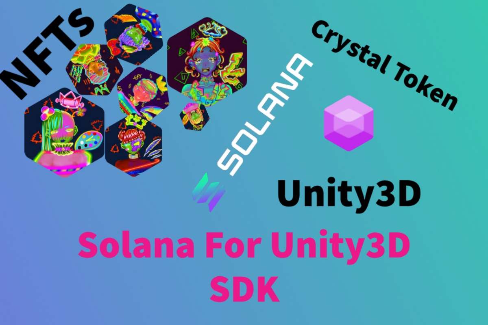

<h1 align="center"> Solana For Unity3D SDK</h1>

SolanaForUnity Asset is required to run example code on this repository.

   - *Android support*
   - *Win & Mac & Linux Standalone support*
   - *Support for preview in the Editor*
   - *Work with Unity Free & Pro*
   - *iOS Support Coming Soon*

**Features**

   - Full JSON RPC API coverage
   - Wallet and accounts
   - Solana Transaction
   - Solana Instruction (SplInstructions & System Instructions)
   - System Program
   - Token Program
   - Associated Token Account Program
   - Metaplex NFT parsing (Metaplex Metadata & Uri Metadata)

**Examples**

   - Fetch Wallet Examples
   - Fetch NFT Examples
   - Spl Instructions Examples
   - System Instrucions Examples
   - JSON RPC API Examples

**System Requirements**

- Build Win Standalone & Preview Editor : Windows10 or later
- Build Mac Standalone & Preview Editor : OSX 10.11 or later
- Build Linux Standalone & Preview Editor : Ubuntu16.04 or later
- Build Android : API level 19 or later

**Coming Soon**

- Token Swap Program
- Stake Program
- Serum Order Book

Follow us on Twitter: 

Join Us On Discord: 

